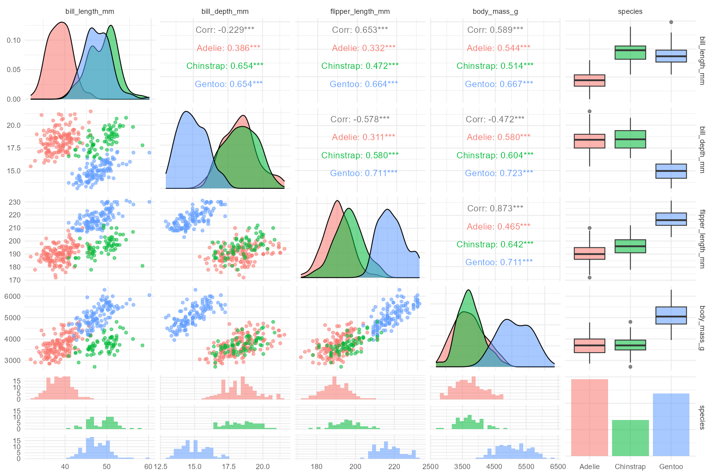

# Welcome to Coding with AI Chatbots

Here we explore the use of various AI Chatbots to generate code for different projects.

Additionally, we explain the limitations of each chatbot when generating code for various tasks

***Please note that comparison of these AI Chatbots is difficult because they offer different default capabilities. These include web search, Deep Research, and varied levels of access to the latest LLMs under their free plans***

## AI Chatbots are obtained from the companies listed below:

1)  [ChatGPT](https://chatgpt.com/)
2)  [Microsoft CoPilot](https://copilot.microsoft.com/)
3)  [Gemini](https://gemini.google.com/app)
4)  [Claude](https://claude.ai/chats)
5)  [Perplexity](https://www.perplexity.ai/)
6)  [Cohere](https://dashboard.cohere.com/)
7)  [Poe](https://poe.com/)
8)  [HuggingChat](https://huggingface.co/chat/)
9)  [Kimi](https://kimi.ai/)
10) [DeepSeek](https://chat.deepseek.com/)
11) [Qwen](https://chat.qwenlm.ai/)
12) [Mistral LeChat](https://chat.mistral.ai/chat)
13) [Google AI Studio](https://aistudio.google.com/)
14) [Allen AI Playground](https://playground.allenai.org/)

## Benchmarking AI Chatbots on simple coding tasks

### 1) Task 1: Generate Pairplots for the Palmer Penguins Dataset

**Date: 25 April 2025**

***NOTE: The AI Chatbots used with "Search On" where applicable. Default model at the time used***

***Prompt template obtained from digitalsreeni YT channel***

Persona: You are a data analyst working on exploratory data analysis at a newly funded startup. Context: You have been tasked with working on the penguins dataset and developing new techniques for EDA. Action: Write an R script to analyze the penguins the dataset, clean and process the data with tidyverse, perform EDA with plots, and finally generate a pairplot. Tone: Professional. Output Format: Provide an R script.

Pairplot Output shown below:

#### 1) ChatGPT

***NOTE: Imported the tidytuesday penguins dataset. Did not use the in-build palmerpenguins dataset.***

#### 2) Microsoft CoPilot

#### 3) Gemini

***NOTE: Also demonstrated how to customize the pairplot***

#### 4) Claude

***NOTE: Simultaneously used both the drop_na() function and na.rm = TRUE which was not necessary.***

#### 5) Perplexity

#### 6) Cohere

***NOTE: Did the least amount of EDA. Plotted the pairplot within a few lines of code.***

#### 7) Poe

***NOTE: Plotted all the columns in the pairplot.***

#### 8) HuggingChat

***NOTE: Failed to run. Error in the code.***

#### 9) Kimi

***Did not use the Kimi Chatbot.***

#### 10) DeepSeek

#### 11) Qwen

#### 12) Mistral LeChat

#### 13) Google AI Studio

#### 14) Allen AI Playground

***NOTE: Failed to run. Error in the code.***

### 2) Task 2: Coming Soon...
